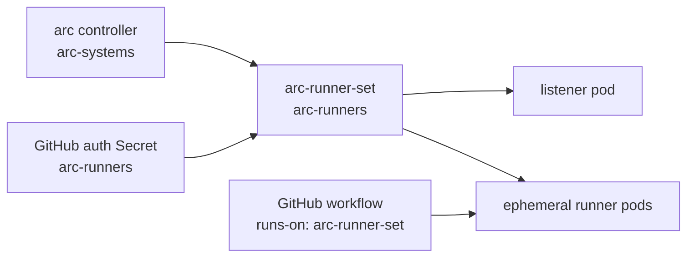

# ARC Runner Scale Set

Dependency wrapper for GitHub's `gha-runner-scale-set` chart. This chart is
separate from `charts/arc` because it needs repository or organization config
and a GitHub auth secret.



## prerequisites

Install the controller first:

```sh
helm install arc ./charts/arc \
  --namespace arc-systems \
  --create-namespace \
  --values charts/arc/values.yaml \
  --values charts/arc/values-ci.yaml
```

Create the runner namespace:

```sh
kubectl create namespace arc-runners
```

Create one auth secret in `arc-runners`. Prefer a GitHub App:

```sh
kubectl create secret generic arc-github-app \
  --namespace arc-runners \
  --from-literal=github_app_id="<app-id>" \
  --from-literal=github_app_installation_id="<installation-id>" \
  --from-file=github_app_private_key=private-key.pem
```

For a short local test, a classic PAT also works:

```sh
kubectl create secret generic arc-github-pat \
  --namespace arc-runners \
  --from-literal=github_token="<pat>"
```

## kind install

`values-kind-runtime.yaml` targets this repo by default. Edit it or pass
`--set` when testing against a different repository, organization, or
enterprise URL.

```sh
helm install arc-runner-set ./charts/arc-runner-set \
  --namespace arc-runners \
  --create-namespace \
  --values charts/arc-runner-set/values.yaml \
  --values charts/arc-runner-set/values-kind-runtime.yaml \
  --set gha-runner-scale-set.githubConfigUrl="https://github.com/garyellis/lab-charts" \
  --set gha-runner-scale-set.githubConfigSecret="arc-github-pat"
```

The Helm release name is the GitHub Actions `runs-on` label:

```yaml
name: arc-kind-smoke
on:
  workflow_dispatch:

jobs:
  smoke:
    runs-on: arc-runner-set
    steps:
      - run: uname -a
      - run: echo "runner from kind"
```

## local validation

`values.yaml` is render-safe and auth-free. It references `arc-github-app` by
name but stores no credential in Helm values. Runtime registration still
requires the Secret to exist and contain valid GitHub credentials.

```sh
uv run chart-manager validate run --chart arc-runner-set --env ci --all
uv run chart-manager charts spec arc-runner-set
```

What kind can validate before a real secret exists:

- Helm dependency resolution from GHCR.
- AutoscalingRunnerSet, listener RBAC, and runner template rendering.
- Kubernetes schema and repo policy checks.
- Controller wiring through `arc-gha-rs-controller`.

What requires a real GitHub URL and secret:

- Listener reconciliation.
- Runner registration.
- Workflow job pickup.
- Scale-up and scale-down behavior.

Use `minRunners: 1` in `values-kind-runtime.yaml` while proving registration.
Use `minRunners: 0` after the setup is working if idle runners are not needed.
