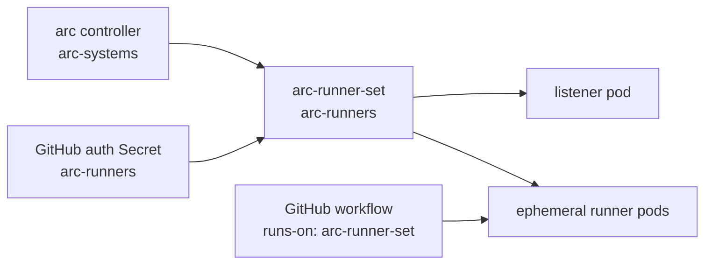

# ARC Runner Scale Set

Dependency wrapper for GitHub's `gha-runner-scale-set` chart. This chart is
separate from `charts/arc` because it needs repository or organization config
and a GitHub auth secret.


```mermaid
flowchart LR
  controller[arc controller<br/>arc-systems] --> scaleset[arc-runner-set<br/>arc-runners]
  secret[GitHub auth Secret<br/>arc-runners] --> scaleset
  scaleset --> listener[listener pod]
  scaleset --> runner[ephemeral runner pods]
  workflow[GitHub workflow<br/>runs-on: arc-runner-set] --> runner
```

## prerequisites

Install the controller first:

```sh
helm install arc ./charts/arc \
  --namespace arc-systems \
  --create-namespace \
  --values charts/arc/values.yaml \
  --values charts/arc/values-ci.yaml
```

Create the runner namespace:

```sh
kubectl create namespace arc-runners
```

Create one auth secret in `arc-runners`. Prefer a GitHub App:

```sh
kubectl create secret generic arc-github-app \
  --namespace arc-runners \
  --from-literal=github_app_id="<app-id>" \
  --from-literal=github_app_installation_id="<installation-id>" \
  --from-file=github_app_private_key=private-key.pem
```

For a short local test, a classic PAT also works:

```sh
kubectl create secret generic arc-github-pat \
  --namespace arc-runners \
  --from-literal=github_token="<pat>"
```

## kind install

`values-kind-runtime.yaml` targets this repo by default. The kind installer
also resolves `harbor.kind.local` to the current Istio gateway Service IP and
copies only the public lab root certificate into the runner namespace. This
keeps kind-only DNS and trust settings out of the default ARC deployment.

```sh
charts/arc-runner-set/install-kind
```

Override its inputs with environment variables when needed:

```sh
GITHUB_CONFIG_URL="https://github.com/<owner>/<repo>" \
GITHUB_CONFIG_SECRET="arc-github-app" \
HARBOR_REGISTRY="harbor.kind.local" \
charts/arc-runner-set/install-kind
```

The source CA Secret (`cert-manager/lab-root-ca-secret`), apps gateway Service,
and GitHub credential Secret must exist before installation. Re-run the
installer after recreating either the kind cluster or gateway Service so the
runner `hostAliases` entry follows the current gateway ClusterIP. Repeated
invocations reconcile the same namespace, public CA ConfigMap, and Helm
release. A CA checksum on the runner template rotates pods when the lab CA
changes.

The kind scale set exposes the `kind` and `runner-scale-set` labels:

```yaml
name: arc-kind-smoke
on:
  workflow_dispatch:

jobs:
  smoke:
    runs-on: [runner-scale-set, kind]
    steps:
      - run: uname -a
      - run: echo "runner from kind"
```

## runner capacity

Each job runner requests 1 CPU and 1 GiB of memory and may burst to 2 CPU and
2 GiB. The request prevents busy nodes from packing runners at the former
development-sized allocation. At the five-runner ceiling, the runner
containers reserve half of the 10-CPU kind node; bursts may still contend.
Docker-in-Docker work runs in ARC's injected sidecar and therefore also
consumes node capacity outside the runner limit.

## local validation

`values.yaml` is render-safe and auth-free. It references `arc-github-app` by
name but stores no credential in Helm values. Runtime registration still
requires the Secret to exist and contain valid GitHub credentials.

```sh
uv run chart-manager chart validate --chart arc-runner-set --env ci --all
uv run chart-manager charts spec arc-runner-set
```

What kind can validate before a real secret exists:

- Helm dependency resolution from GHCR.
- AutoscalingRunnerSet, listener RBAC, and runner template rendering.
- Kubernetes schema and repo policy checks.
- Controller wiring through `arc-gha-rs-controller`.

What requires a real GitHub URL and secret:

- Listener reconciliation.
- Runner registration.
- Workflow job pickup.
- Scale-up and scale-down behavior.

Use `minRunners: 1` in `values-kind-runtime.yaml` while proving registration.
Use `minRunners: 0` after the setup is working if idle runners are not needed.
