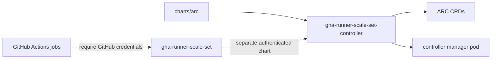
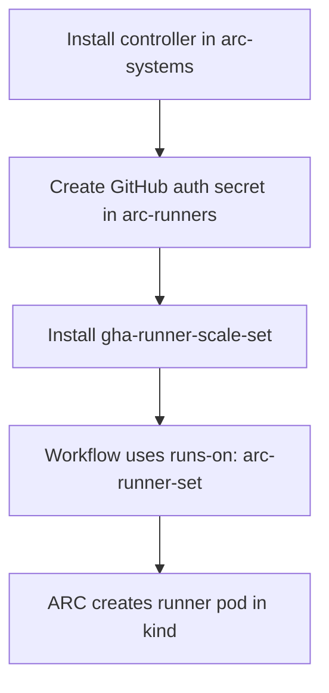

# GitHub Actions Runner Controller

Dependency wrapper for the GitHub `gha-runner-scale-set-controller` Helm chart.



## kind install

Controller-only install:

```sh
NAMESPACE=arc-systems
helm install arc ./charts/arc \
  --namespace "${NAMESPACE}" \
  --create-namespace \
  --values charts/arc/values.yaml \
  --values charts/arc/values-ci.yaml
```

Equivalent upstream install:

```sh
NAMESPACE=arc-systems
helm install arc \
  --namespace "${NAMESPACE}" \
  --create-namespace \
  oci://ghcr.io/actions/actions-runner-controller-charts/gha-runner-scale-set-controller
```

## run jobs from kind

ARC runners use outbound connections to GitHub. kind does not need an inbound
route from GitHub, but runner pods must reach `github.com`, `api.github.com`,
and required image registries.

Install order:



Use a separate namespace for runners:

```sh
kubectl create namespace arc-runners
```

Create one auth secret in `arc-runners`. Prefer a GitHub App for repository
or organization runners:

```sh
kubectl create secret generic arc-github-app \
  --namespace arc-runners \
  --from-literal=github_app_id="<app-id>" \
  --from-literal=github_app_installation_id="<installation-id>" \
  --from-file=github_app_private_key=private-key.pem
```

GitHub App permissions:

- Repository runners: Repository `Administration: Read and write`, Repository
  `Metadata: Read-only`, Organization `Self-hosted runners: Read and write`.
- Organization runners: Repository `Metadata: Read-only`, Organization
  `Self-hosted runners: Read and write`.

For a short local test, a classic PAT also works:

```sh
kubectl create secret generic arc-github-pat \
  --namespace arc-runners \
  --from-literal=github_token="<pat>"
```

Classic PAT scopes:

- Repository runners: `repo`.
- Organization runners: `admin:org`.

Install the vendored runner scale set wrapper. The release name is the
`runs-on` label:

```sh
INSTALLATION_NAME=arc-runner-set
GITHUB_CONFIG_URL=https://github.com/<owner>/<repo>

helm install "${INSTALLATION_NAME}" \
  ./charts/arc-runner-set \
  --namespace arc-runners \
  --create-namespace \
  --values charts/arc-runner-set/values.yaml \
  --values charts/arc-runner-set/values-kind-runtime.yaml \
  --set gha-runner-scale-set.githubConfigUrl="${GITHUB_CONFIG_URL}" \
  --set gha-runner-scale-set.githubConfigSecret=arc-github-app
```

Use `gha-runner-scale-set.githubConfigSecret=arc-github-pat` if using the PAT
secret.

Minimal workflow:

```yaml
name: arc-kind-smoke
on:
  workflow_dispatch:

jobs:
  smoke:
    runs-on: arc-runner-set
    steps:
      - run: uname -a
      - run: echo "runner from kind"
```

Check registration and job pickup:

```sh
helm list -A
kubectl get pods -n arc-systems
kubectl get pods -n arc-runners -w
kubectl logs -n arc-runners -l app.kubernetes.io/component=runner-scale-set-listener
```

Use `minRunners=1` while proving registration. With `minRunners=0`, runner
pods are created only when GitHub queues a matching job.

Container jobs, service containers, Docker builds, and Docker-based actions
need extra runner scale set configuration. For kind smoke tests, start with
plain shell jobs. If container jobs are required, set `containerMode.type` to
`dind` or `kubernetes-novolume`; `dind` uses privileged pods.

## local validation

What kind can validate without GitHub credentials:

- Helm dependency resolution from GHCR.
- CRD and controller manifest rendering.
- Kubernetes schema and repo policy checks.
- Controller pod scheduling and readiness in `arc-systems`.

What kind cannot validate by itself:

- Runner registration with GitHub.
- Workflow job pickup.
- Runner scale-up, scale-down, or listener behavior.

Those require a separate `gha-runner-scale-set` release, a GitHub repository,
organization, or enterprise URL, and a Kubernetes secret containing either a
PAT or GitHub App credentials. Keep runner pods in a namespace separate from
`arc-systems`.

## chart-manager

```sh
uv run chart-manager validate run --chart arc --env ci --all
uv run chart-manager charts spec arc
uv run chart-manager helmrelease test --chart arc --version 0.1.0 --namespace arc-systems
```
