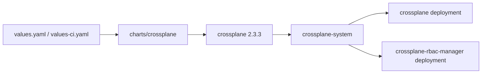

# Crossplane

Umbrella chart for installing Crossplane from the upstream stable Helm repository.



## Usage

```sh
helm dependency update charts/crossplane
helm upgrade --install crossplane charts/crossplane \
  --namespace crossplane-system \
  --create-namespace \
  -f charts/crossplane/values.yaml \
  -f charts/crossplane/values-ci.yaml
helm test crossplane --namespace crossplane-system
```

The upstream install guide maps to this chart as:

```sh
helm repo add crossplane-stable https://charts.crossplane.io/stable
helm install crossplane --namespace crossplane-system crossplane-stable/crossplane
```

Dependency values are nested under `crossplane:` because this is an umbrella chart.
