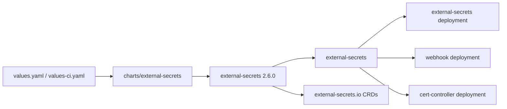

# External Secrets Operator

Umbrella chart for installing External Secrets Operator from the upstream Helm repository.



## Usage

```sh
helm dependency update charts/external-secrets
helm upgrade --install external-secrets charts/external-secrets \
  --namespace external-secrets \
  --create-namespace \
  -f charts/external-secrets/values.yaml \
  -f charts/external-secrets/values-ci.yaml
helm test external-secrets --namespace external-secrets
```

The upstream install guide maps to this chart as:

```sh
helm repo add external-secrets https://charts.external-secrets.io
helm install external-secrets \
  external-secrets/external-secrets \
  -n external-secrets \
  --create-namespace
```

CRDs are installed by Helm with `external-secrets.installCRDs: true`. Dependency values are nested under `external-secrets:` because this is an umbrella chart.
