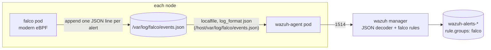

# Falco

Umbrella chart for [Falco](https://falco.org/) 0.45.0 using upstream chart
`falcosecurity/falco` 9.2.0 from `https://falcosecurity.github.io/charts`.
Upstream values stay nested under `falco:`.

Falco watches every node's syscalls and raises alerts from its default
ruleset (shells and credential searches in containers, sensitive file reads,
and so on). Alerts reach Wazuh through a file on the node, not through a
network output:



Why a file: the Wazuh agent already runs on every node (`charts/wazuh-agent`)
and reads host `/var/log`, so there's no extra service, credential, or
network path. Falco's stdout isn't used for delivery because the container
runtime prefixes every line, which breaks Wazuh's JSON decoder. Stdout stays
on for `kubectl logs`.

## Configuration decisions

- **Driver `modern_ebpf`.** The CO-RE probe is built into the Falco binary.
  It needs kernel 5.8+ with BTF (`/sys/kernel/btf/vmlinux`), and nothing
  else: no kernel headers, module build, or driver-loader init container.
  Docker Desktop's kind node runs 6.12 with BTF. On arm64 Falco logs that the
  `open`/`creat` tracepoints are missing. Those syscalls don't exist on arm64,
  so the warning is harmless.
- **No falcoctl.** The image already ships the default ruleset
  (`/etc/falco/falco_rules.yaml`) and the container plugin. Turning off
  falcoctl's install and follow means nothing is downloaded at runtime, and
  the rules only change when the image tag changes (Renovate tracks it).
- **CRI only.** Container metadata (`k8s.ns.name`, `k8s.pod.name`,
  `container.*`) comes from the containerd socket. The other engines are off,
  so their sockets aren't mounted.
- **Priority threshold** `falco.falco.priority: notice`. The default ruleset
  has one Informational rule; everything else is Notice or above. Raise it to
  `warning` to cut volume.
- **Rules.** The upstream default ruleset only. Add custom rules through the
  upstream `falco.customRules` value.

## Privileges (and the policy exception)

Falco runs as root with `leastPrivileged: true`. That means
`privileged: false` and only the capabilities the eBPF probe and `/proc`
scanning need: `BPF`, `PERFMON`, `SYS_RESOURCE` (ring-buffer memory lock),
and `SYS_PTRACE` (reading other processes' `/proc` entries). On top of the
upstream leastPrivileged set, `containerSecurityContext` also pins
`allowPrivilegeEscalation: false` and `seccompProfile: RuntimeDefault` (the
upstream helper omits both). The container security context is a full
override, not a merge, so the capability set is re-declared in `values.yaml`.
No host namespaces. Host mounts: `/proc`, `/etc` (read-only), `/sys/kernel`
(read-only), the containerd socket directory, and `/var/log/falco`.

Two host mounts stay wider than ideal, both dictated by upstream and left as
is on purpose:

- **`/proc` is read-write.** Upstream only sets `/host/proc` read-only when
  the kernel-module driver loader is disabled, which simultaneously adds
  `/host/boot`, `/host/lib/modules` and `/host/usr` mounts meant for the
  `kmod` driver. Trading a read-only `/proc` for three extra host mounts is a
  net loss, so `/proc` stays read-write.
- **The whole containerd socket directory is mounted, not the socket file.**
  Upstream mounts `dir(socket)` so that if containerd restarts and recreates
  the socket inode, Falco follows the new one; a bind-mounted file would pin
  the stale inode and event enrichment would silently stop.

Access to the containerd socket is the most powerful of these. Container
metadata needs it, and it's the reason Falco belongs in a namespace no one
else deploys to.

## Node scheduling

`podPriorityClassName: system-node-critical` keeps the sensor from being
evicted under node pressure. The DaemonSet tolerates the control-plane taints
so every node is covered.

`affinity` requires `kubernetes.io/os: linux` (modern eBPF is Linux-only).
The real driver prerequisite is kernel >= 5.8 with BTF, and there is no
standard node label for that, so this chart does not hard-gate on it: a
required affinity keyed on a nonexistent label would strand Falco on every
node, and `falcoctl`/driver-loader are off so there is no fallback driver.
On a homogeneous BTF-capable fleet (the kind lab, most modern clusters)
nothing more is needed. On a mixed-kernel cluster, label the BTF-capable
nodes (e.g. `falco.org/driver=modern_ebpf`) and override `falco.affinity` to
require that label, otherwise the pod CrashLoops on any node without BTF.

The repo's `require-non-root` policy can't pass, and the pipeline has no
per-resource exception. `chart-lifecycle.yaml` therefore sets
`validators.policy: false`, the same approach `charts/wazuh` and
`charts/wazuh-agent` use. `tests/render-contract.sh` re-asserts the boundary:
not privileged, exactly that capability set, no host namespaces, no init
containers, only the expected writable host paths, and pinned images.

## File growth

Falco never rotates `events.json`, so the file grows for as long as the node
lives. An alert is about 1.3 KB, so a workload tripping a rule once a second
adds about 110 MB a day.

`file_output.keep_alive: false` makes Falco open, append, and close the file
for each alert, so node-level rotation is safe either way. The Wazuh agent
picks up a truncated file immediately and a renamed one within about a
minute (both checked on kind). On long-lived nodes, add a logrotate rule for
`/var/log/falco/events.json` to the node image, e.g. `daily`, `rotate 3`,
`maxsize 100M`, `missingok`. Plain rename is enough; `copytruncate` isn't
needed and can drop lines. kind nodes are ephemeral and have none.

Under a syscall burst Falco can drop kernel events (it logs the drop count
and exposes it as a metric); raise `driver.modernEbpf.bufSizePreset` if a node
sustains drops. Downstream, the wazuh-agent logcollector and the manager's
analysisd each impose their own EPS ceilings, so a flood of Falco alerts can
also be shed there before it reaches the index.

## Wazuh rules

The Wazuh manager needs rules to turn decoded Falco JSON into alerts. They
live in `charts/wazuh` `files/manager/falco_rules.xml`, not in this chart:
IDs 100100-100105 in group `falco`. Falco's priority maps to the Wazuh level:

| Falco priority | Wazuh rule | Level |
| --- | --- | --- |
| Emergency, Alert, Critical | 100101 | 12 |
| Error | 100102 | 10 |
| Warning | 100103 | 7 |
| Notice | 100104 | 5 |
| Informational, Debug | 100105 | 3 |

The alert description is
`Falco <priority>: <rule> (ns=<namespace> pod=<pod>)`. The full Falco
alert (`output`, `output_fields`, `tags`) is under `data.*`.

## Usage

```sh
helm dependency build charts/falco
helm upgrade --install falco charts/falco \
  --namespace falco --create-namespace \
  -f charts/falco/values.yaml
```

The `charts/wazuh-agent` default `logs[]` already includes
`/host/var/log/falco/events.json` with `format: json`.

## Validation

```sh
charts/falco/tests/render-contract.sh charts/falco
uv run chart-manager chart validate falco
uv run chart-manager local up --chart falco --profile minimal
helm test falco -n falco
```

The helm test pod (non-root, no service account token) runs
`find /tmp -name id_rsa.<uuid>`. That triggers the default rule
"Search Private Keys or Passwords" (Warning). The pod then waits up to
`tests.timeoutSeconds` for that alert, with its unique marker, in the node's
`events.json`, which it mounts read-only. The pod reads the file on the node
it runs on, so the trigger and the evidence are always on the same node.

The `minimal` profile doesn't require Wazuh. The file is the contract between
the two charts, and the Wazuh stack is too heavy to install for every Falco
change. To check the whole path with Wazuh installed, run the helm test, then
look in `wazuh-alerts-*` for `rule.id: 100103` with
`data.output_fields.proc.cmdline` containing the marker.
