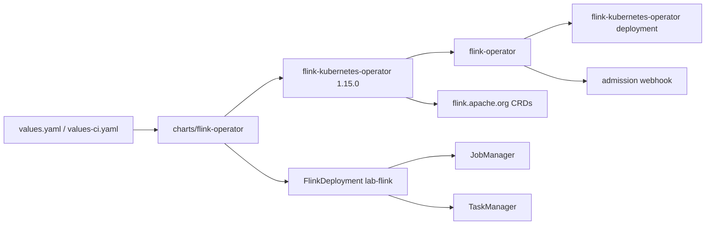

# Apache Flink Kubernetes Operator

Umbrella chart for installing the Apache Flink Kubernetes Operator from the
upstream Apache Helm repository, plus a self-verifying sample `FlinkDeployment`.



## Usage

```sh
helm dependency update charts/flink-operator
helm upgrade --install flink-operator charts/flink-operator \
  --namespace flink-operator \
  --create-namespace \
  -f charts/flink-operator/values.yaml \
  -f charts/flink-operator/values-ci.yaml
helm test flink-operator --namespace flink-operator
```

The upstream install guide maps to this chart as:

```sh
helm repo add flink-operator-repo \
  https://downloads.apache.org/flink/flink-kubernetes-operator-1.15.0/
helm install flink-kubernetes-operator \
  flink-operator-repo/flink-kubernetes-operator \
  -n flink-operator \
  --create-namespace
```

Operator values are nested under `flink-kubernetes-operator:` because this is an
umbrella chart. CRDs are installed by Helm from the upstream chart's `crds/`
directory.

### Admission webhook (cert-manager)

The upstream chart's optional admission webhook wires to cert-manager (renders a
`Certificate` / `Issuer` and uses `cert-manager.io/inject-ca-from`). It is
**disabled by default** here so the chart installs standalone. To enable
FlinkDeployment spec validation, install `charts/cert-manager` first, then set:

```yaml
flink-kubernetes-operator:
  webhook:
    create: true
```

## The sample FlinkDeployment

`flinkDeployment` renders a `FlinkDeployment` CR in the release namespace. It
defaults to Flink's built-in StateMachine streaming example
(`local:///opt/flink/examples/streaming/StateMachine.jar`), so the install is
self-verifying with no external dependency — the `helm test` waits for the job
manager to report `READY`.

To run your own job, point `flinkDeployment.job.jarURI` at your jar (bundled in
a custom `flinkDeployment.image`, or mounted). Set `flinkDeployment.enabled:
false` to install only the operator and submit `FlinkDeployment` /
`FlinkSessionJob` resources separately.

### Wiring to Strimzi Kafka

This lab already runs Strimzi (see `charts/strimzi-kafka-operator`). A Flink job
can consume/produce against the in-cluster bootstrap
`lab-kafka-kafka-bootstrap.<namespace>.svc:9092` using the Flink Kafka
connector. Bundle the connector + your job jar into a custom image and set it as
`flinkDeployment.image` / `flinkDeployment.job.jarURI`.
