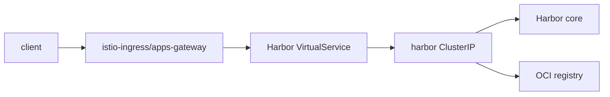

# Harbor

Umbrella chart for Harbor 2.15.1 using upstream chart 1.19.1. The upstream
ingress is disabled; the wrapper exposes Harbor through the shared Istio apps
gateway at `https://harbor.k8s.home.lab.io`.



## Prerequisites

Create the production secrets before installation:

```sh
kubectl create namespace harbor
kubectl -n harbor create secret generic harbor-admin \
  --from-literal=HARBOR_ADMIN_PASSWORD='<admin-password>'
kubectl -n harbor create secret generic harbor-secret-key \
  --from-literal=secretKey='<exactly-16-characters>'
```

The default persistent configuration uses the `csi-cinder-sc-delete` storage
class. Override the nested `harbor.persistence` values if the target cluster
uses a different class.

## Usage

```sh
helm dependency update charts/harbor
helm upgrade --install harbor charts/harbor \
  --namespace harbor \
  --create-namespace \
  -f charts/harbor/values.yaml
```

Keep `harbor.externalURL` aligned with the VirtualService host when overriding
`appsDomain`, `istio.hostPrefix`, or `istio.hosts`.

## Validation

```sh
mise run validate -- --all --chart harbor --env ci
mise run kind-test -- harbor --profile minimal
mise run kind-test -- harbor --profile routed
```

CI uses ephemeral storage, disables Trivy, and supplies deterministic local-only
secrets. The `routed` profile additionally tests the API through the Istio TLS
gateway and VirtualService. Dependency settings remain nested under `harbor:`
because this is an umbrella chart.
