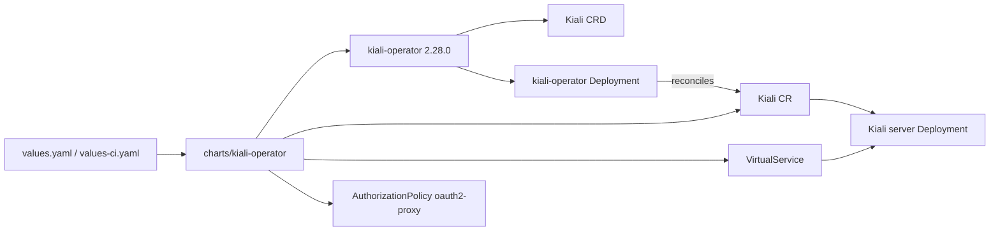

# Kiali Operator

Umbrella chart for the [Kiali](https://kiali.io) operator. It vendors the
upstream `kiali-operator` chart and adds the integration resources the lab
needs to expose Kiali through the shared Istio gateway.



## Layout

The operator is the deliverable of the vendored chart. This umbrella adds
three resources of its own, each toggleable:

| Resource | Toggle | Target |
| --- | --- | --- |
| `Kiali` CR | `kiali.enabled` | `istio-system`; the operator reconciles it into a Kiali server |
| `VirtualService` | `virtualService.enabled` | routes `istio-ingress/apps-gateway` to the Kiali server |
| `AuthorizationPolicy` | `authorizationPolicy.enabled` | fronts the Kiali host with oauth2-proxy at the gateway |

Upstream operator values are nested under `kiali-operator:` because this is an
umbrella chart. The operator's own `cr.create` is `false` — the umbrella owns
the Kiali CR via `templates/kiali.yaml`, so the whole CR spec is editable from
`kiali.spec` in values without a template change.

## Usage

```sh
helm dependency update charts/kiali-operator
helm upgrade --install kiali-operator charts/kiali-operator \
  --namespace kiali-operator \
  --create-namespace \
  -f charts/kiali-operator/values.yaml
helm test kiali-operator --namespace kiali-operator
```

The upstream install guide maps to this chart as:

```sh
helm repo add kiali https://kiali.org/helm-charts
helm install kiali-operator kiali/kiali-operator \
  --namespace kiali-operator --create-namespace
```

The Kiali CRD and cluster-scoped RBAC are installed by Helm through the
dependency. The operator watches all namespaces and reconciles the `Kiali`
CR (in `istio-system`) into a Kiali server wired to the lab's Mimir,
Grafana, and Tempo backends. Authentication is delegated to oauth2-proxy at
the gateway, so Kiali itself runs with `auth.strategy: anonymous`.

## kind / CI

`values-ci.yaml` installs the operator alone. kind has no Istio mesh or
observability stack, so the Kiali CR, VirtualService, and AuthorizationPolicy
are disabled there — the `minimal` test profile verifies only that the
operator becomes Available and registers the `kialis.kiali.io` CRD.

```sh
chart-manager validate run --chart kiali-operator --all
chart-manager sandbox test kiali-operator --profile minimal --namespace kiali-operator
```

To exercise the full integration (Kiali CR + gateway routing) you need the
`istio-base`, `istiod`, `istio-gateway`, and observability charts installed;
run it against the lab stack rather than the minimal kind profile.
