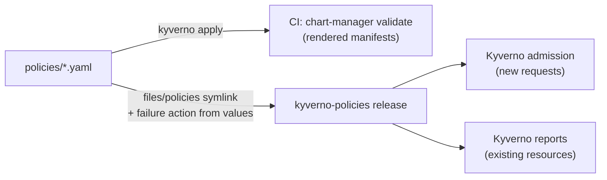

# Kyverno policies

The cluster's admission policies, installed as a release separate from the
[`kyverno`](../kyverno/README.md) engine chart, whose CRDs they need:

- **Repository policies**: every ClusterPolicy in the repository's
  [`policies/`](../../policies), the same files `chart-manager validate`
  applies to rendered charts in CI.
- **Pod Security Standards baseline**: upstream chart `kyverno/kyverno-policies`
  3.9.1 from `https://kyverno.github.io/kyverno/`, as ValidatingPolicies.
  Upstream values stay nested under `kyverno-policies:`.

## One policy source for CI and cluster

`files/policies` is a symlink to `../../../policies`. Helm follows it when
rendering or packaging (and logs `found symbolic link in path`), so the chart
installs exactly the files CI evaluates. Adding a policy to `policies/` adds it
to both, and a change there revalidates every chart, this one included.



The template changes one field, `spec.validationFailureAction`, which the
chart owns so the cluster can enforce a policy independently of CI. Everything
else is the file as written.

## Audited vs enforced

Everything runs in **Audit**: violations are recorded in PolicyReports and
nothing is blocked. That is deliberate, because workloads already on the
cluster violate these policies by design (the wazuh manager and agent and
kind's local-path-provisioner run as root; cilium is privileged and uses host
namespaces and paths).

| Policy | Source | Default |
| --- | --- | --- |
| `require-non-root`, `forbid-load-balancer` | `policies/` | Audit |
| PSS baseline (`disallow-privileged-containers`, `disallow-host-path`, ...) | upstream | Audit |

Switch a repository policy to Enforce by listing its name. An unknown name
fails the render.

```yaml
repositoryPolicies:
  enforce:
    - forbid-load-balancer
```

Switch Pod Security Standards with upstream values:

```yaml
kyverno-policies:
  validationFailureActionByPolicy:
    disallow-privileged-containers: Enforce   # one policy
  # validationFailureAction: Enforce          # all of them
```

Before enforcing, check the policy's reports have no failures you intend to
keep, then add exceptions for those. Enforcement applies to new requests only;
running Pods are not evicted. The kyverno chart fails open, so nothing is
enforced while Kyverno is down.

## Reading reports

```sh
kubectl get policyreport -A                      # one report per resource
kubectl get policyreport -A -o json | jq -r '.items[] | .scope as $s
  | .results[] | select(.result == "fail")
  | "\($s.namespace)/\($s.kind)/\($s.name)  \(.policy)"'
```

Background scans rerun hourly and whenever a policy changes.

## Adding an exception

Use a `PolicyException` in the `kyverno` namespace; exceptions anywhere else
are ignored. Keeping them there means granting one needs write access to
Kyverno's namespace, and each exemption is a reviewable object naming its
policy, rules and resources, rather than an edit to the shared policy. Add it
to this chart's `templates/`.

```yaml
apiVersion: kyverno.io/v2
kind: PolicyException
metadata:
  name: wazuh-manager-runs-as-root
  namespace: kyverno
spec:
  exceptions:
    - policyName: require-non-root
      ruleNames:
        - containers-must-run-as-non-root
        - pod-must-run-as-non-root
  match:
    any:
      - resources:
          kinds: [StatefulSet, Pod]
          namespaces: [wazuh]
          names: [wazuh-manager-*]
```

Pod Security Standards are ValidatingPolicies, so they take a
`policies.kyverno.io/v1` PolicyException with `policyRefs` instead.

Cluster exceptions do not reach CI. A chart that cannot satisfy a repository
policy opts out there in its `chart-lifecycle.yaml`
(`validation.validators.policy: false`), with the reason next to it; see
`charts/wazuh`.

## Uninstall order

This release only holds custom resources; the [`kyverno`](../kyverno/README.md)
engine release owns their CRDs. Uninstalling the engine deletes those CRDs and
cascade-deletes every policy cluster-wide, this release's included. **Uninstall
`kyverno-policies` before `kyverno`**, and reinstall this release if the engine
is ever removed and reinstalled.

## Planned / known debt

The repository policies are `kyverno.io/v1` `ClusterPolicy` and the exception
example above is a `kyverno.io/v2` `PolicyException`. Both API kinds are
deprecated in Kyverno 1.19 (upstream flags them for removal in a later release).
The intended migration is to the CEL-based `policies.kyverno.io` types —
`ValidatingPolicy` and its `PolicyException` — as the Pod Security Standards
policies already use. Tracked as known debt; the policies are not migrated yet.

## Validation

```sh
uv run chart-manager chart validate kyverno-policies
uv run chart-manager local up --chart kyverno-policies --profile minimal
helm test kyverno-policies -n kyverno
```

The helm test waits for every installed policy to report Ready, meaning
Kyverno compiled it and registered its webhook rules. Admission decisions are
proven by the kyverno chart's test.
