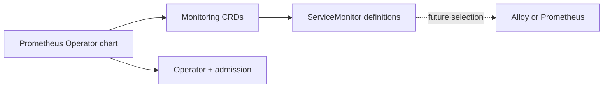

# Prometheus Operator

This umbrella chart pins `kube-prometheus-stack` 80.13.3 and installs its
Prometheus Operator controller, admission webhook, and all monitoring CRDs.
It does not install Prometheus, Alertmanager, Grafana, Thanos Ruler,
node-exporter, or kube-state-metrics.

The wrapper keeps intentional ServiceMonitor definitions for the operator,
Cilium/Hubble, and Istio. Those objects are configuration only until a future
collector selects them. The upstream kube-prometheus-stack default rules are
disabled because they describe workloads this wrapper does not install.



## Usage

```shell
helm upgrade --install prometheus-operator charts/prometheus-operator \
  --namespace monitoring \
  --create-namespace \
  -f charts/prometheus-operator/values.yaml
```

Install this chart before charts that render `ServiceMonitor` or
`PrometheusRule` resources. The operator validates and manages custom
resources, but it does not scrape metrics or evaluate rules itself.

## Validation

```shell
mise run validate -- --chart prometheus-operator --env ci
mise run kind-test -- prometheus-operator --profile minimal
```
