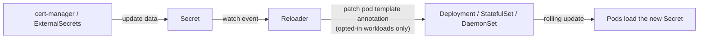

# Reloader

Umbrella chart for [Stakater Reloader](https://github.com/stakater/Reloader)
v1.4.22 using upstream chart `stakater/reloader` 2.2.17 from
`https://stakater.github.io/stakater-charts`. Upstream values stay nested under
`reloader:`.

Reloader rolls a workload when a Secret or ConfigMap it uses changes. It
covers processes that read TLS material or credentials only at startup: a
cert-manager renewal or an ExternalSecrets refresh updates the Secret, but the
running process keeps the old certificate until it expires in memory.



## Opting a workload in

Nothing is reloaded unless the workload asks for it (`autoReloadAll: false`).
Put the annotation on the workload's `metadata.annotations`, not on the pod
template.

| Annotation | Reloads on |
| --- | --- |
| `secret.reloader.stakater.com/reload: "a,b"` | the named Secrets only (preferred: explicit) |
| `secret.reloader.stakater.com/auto: "true"` | every Secret the pod template references |
| `reloader.stakater.com/auto: "true"` | every Secret and ConfigMap the pod template references |

A cert-manager Certificate and the StatefulSet that serves it:

```yaml
apiVersion: cert-manager.io/v1
kind: Certificate
metadata:
  name: indexer-tls
spec:
  secretName: indexer-tls          # the Secret Reloader watches
  dnsNames: [indexer.wazuh.svc]
  issuerRef: {name: lab-ca, kind: ClusterIssuer}
---
apiVersion: apps/v1
kind: StatefulSet
metadata:
  name: indexer
  annotations:
    secret.reloader.stakater.com/reload: indexer-tls
spec:
  template:
    spec:
      volumes:
        - name: tls
          secret:
            secretName: indexer-tls
```

The same annotation works for a Secret written by an `ExternalSecret`
(`spec.target.name`).

## Configuration decisions

- **Reload strategy `annotations`.** Reloader records the change as the
  `reloader.stakater.com/last-reloaded-from` pod-template annotation instead of
  injecting a `STAKATER_*` env var into containers. Container specs stay exactly
  as Git renders them, and Helm's three-way merge, Flux drift detection and
  Argo CD all leave an unrendered annotation alone, so a consumer chart's
  upgrade neither reverts nor fights the reload.
- **Updates only.** `reloadOnCreate`, `reloadOnDelete` and `syncAfterRestart`
  are off. With the annotations strategy, sync-after-restart has no "already
  applied" check and would roll every opted-in workload each time Reloader
  restarts.
- **One cluster-wide instance** (`watchGlobally: true`, one replica). Consumers
  live in many namespaces. For HA set `reloader.reloader.enableHA: true` and
  `reloader.reloader.deployment.replicas: 2`.
- **Hardened pod:** UID 65534, read-only root filesystem, all capabilities
  dropped, `RuntimeDefault` seccomp, image pinned by digest.
- **Metrics:** a PodMonitor is available but off by default, so the chart does
  not depend on the prometheus-operator CRDs. Enable it with
  `reloader.reloader.podMonitor.enabled: true` where those CRDs exist.

## Failure modes

- A Secret that changes while Reloader is down is not replayed when it comes
  back. The lab accepts this for a single replica. `enableHA` narrows the
  window. The backstop should be an alert on the certificate a workload
  actually serves, which does not exist yet.
- Reloader needs cluster-wide `list/watch` on Secrets and ConfigMaps, and
  `patch` on workloads. This is the upstream ClusterRole.

## Usage

```sh
helm dependency build charts/reloader
helm upgrade --install reloader charts/reloader \
  --namespace reloader --create-namespace \
  -f charts/reloader/values.yaml
```

## Validation

```sh
uv run chart-manager chart validate reloader
uv run chart-manager local up --chart reloader --profile minimal
helm test reloader -n reloader
```

The helm test creates a Secret and two Deployments that mount it, one opted in
with `secret.reloader.stakater.com/reload`. It then rotates the Secret and
asserts two things. The opted-in Deployment gains the `last-reloaded-from`
annotation and finishes its rollout. The unannotated Deployment stays at
generation 1. If Reloader is scaled to zero, the test fails.
