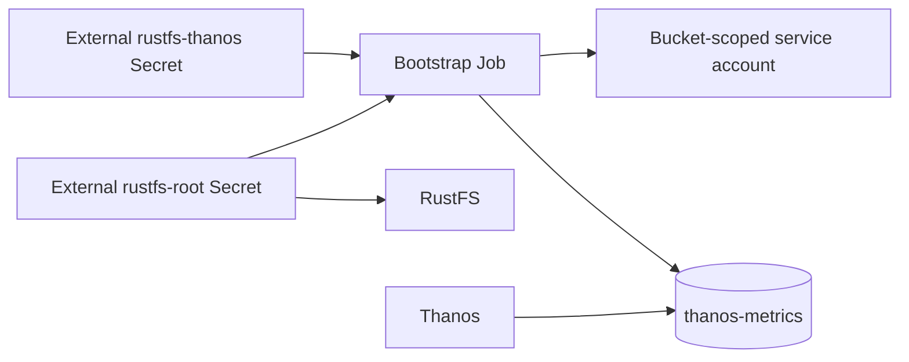

# RustFS

This umbrella chart pins `rustfs/rustfs` 0.12.0 (RustFS 1.0.0-beta.12) and
deploys a private, standalone object store for the observability hub. The
default topology is one pod, one 100 GiB data PVC, and no separate log PVC.
RustFS writes logs to container stdout and exposes only a ClusterIP Service.



## Secret contract

Create both Secrets in the release namespace before installing the production
values:

| Secret | Key | Consumer |
|---|---|---|
| `rustfs-root` | `RUSTFS_ACCESS_KEY` | RustFS and bootstrap Job |
| `rustfs-root` | `RUSTFS_SECRET_KEY` | RustFS and bootstrap Job |
| `rustfs-thanos` | `accessKey` | bootstrap Job |
| `rustfs-thanos` | `secretKey` | bootstrap Job |

Use non-default, randomly generated credentials. Production credentials must be
managed outside Helm, normally through Flux and SOPS. The separate
`thanos-objstore` Secret supplies the `rustfs-thanos` credentials to Thanos in
its `objstore.yml`; this chart does not create that configuration Secret.

The post-install/post-upgrade bootstrap Job waits for readiness, creates
`thanos-metrics` if absent, and creates or updates a service-account policy
limited to that bucket. On upgrade it reconciles the policy, description, and
secret key for an existing workload access key.

## Usage

```shell
helm dependency update charts/rustfs
helm upgrade --install rustfs charts/rustfs \
  --namespace observability \
  --create-namespace \
  -f charts/rustfs/values.yaml
```

The stable in-cluster S3 endpoint is `http://rustfs-svc:9000`. There is no
Ingress, Gateway API route, NodePort, LoadBalancer, or enabled console by
default. Override `rustfs.storageclass.name` where `local-path` is unavailable.

## Validation

```shell
mise run validate -- --chart rustfs --env ci
mise run kind-test -- rustfs --profile minimal
```

The CI overlay creates deterministic, non-default local credentials and a
small ephemeral-sized PVC. Those credentials are test-only and must never be
used in a deployed environment.
