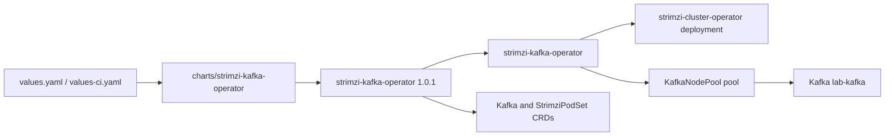

# Strimzi Kafka Operator

Umbrella chart for installing Strimzi Kafka Operator from the upstream Helm repository.



## Usage

```sh
helm dependency update charts/strimzi-kafka-operator
helm upgrade --install strimzi-kafka-operator charts/strimzi-kafka-operator \
  --namespace strimzi-kafka-operator \
  --create-namespace \
  -f charts/strimzi-kafka-operator/values.yaml \
  -f charts/strimzi-kafka-operator/values-ci.yaml
helm test strimzi-kafka-operator --namespace strimzi-kafka-operator
```

The upstream install guide maps to this chart as:

```sh
helm repo add strimzi https://strimzi.io/charts/
helm install strimzi-kafka-operator \
  strimzi/strimzi-kafka-operator \
  --namespace strimzi-kafka-operator \
  --create-namespace
```

CRDs and cluster-scoped RBAC are installed by Helm through the Strimzi dependency. Dependency values are nested under `strimzi-kafka-operator:` because this is an umbrella chart.

The chart also templates a small KRaft Kafka cluster by default:

- `KafkaNodePool/pool`: one combined controller and broker using a persistent claim.
- `Kafka/lab-kafka`: Kafka `4.2.0` with an internal plaintext listener on port `9092`.
- `values-ci.yaml`: adds a kind-only NodePort listener for Mac clients.
- `entityOperator`: topic and user operators enabled.

Set `kafkaCluster.enabled: false` to install only the operator and CRDs.

## kind Access From macOS

`values-ci.yaml` and `kind-config.yaml` expose a local listener for CLI tools on the host:

```sh
kcat -b localhost:32092 -L
kafka-topics --bootstrap-server localhost:32092 --list
```

The bootstrap endpoint is `localhost:32092`. Broker 0 is advertised as `localhost:32093`, matching the kind host port mapping.
