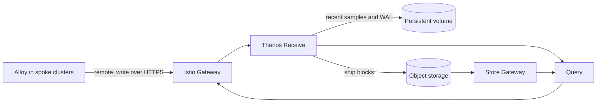

# Thanos

This umbrella chart pins `thanos-community/thanos` 0.33.0 (Thanos v0.42.4). It deploys Thanos Receive alongside the existing Alloy-to-Mimir metrics path; it does not replace Mimir or install the upstream chart's optional `kube-prometheus-stack` dependency.



## Prerequisites

- Kubernetes 1.30 or later (required by the upstream chart).
- Prometheus Operator CRDs from the repository's `prometheus-operator` chart. ServiceMonitors and Thanos PrometheusRules are enabled; the upstream chart's optional `kube-prometheus-stack` dependency remains disabled.
- A default StorageClass, or explicit `thanos.receive.persistence.storageClass`, `thanos.storegateway.persistence.storageClass`, and `thanos.compactor.persistence.storageClass` overrides.
- A Secret named `thanos-objstore` containing the key `objstore.yml`. Flux decrypts the SOPS/age source and creates this Secret before the HelmRelease. This chart does not own production object-store credentials.

Example S3-compatible Secret source (encrypt this manifest with SOPS before committing it):

```yaml
apiVersion: v1
kind: Secret
metadata:
  name: thanos-objstore
  namespace: observability
stringData:
  objstore.yml: |
    type: S3
    config:
      bucket: thanos
      endpoint: s3.example.com
      region: us-west-2
      access_key: replace-me
      secret_key: replace-me
```

Thanos supports stable production clients for S3/S3-compatible storage, GCS,
and Azure Blob. OpenStack Swift, Tencent COS, Aliyun OSS, and OCI Object
Storage are currently beta; filesystem storage is for testing only. Production
should use a strongly consistent external bucket. RustFS is enabled only in
`values-ci.yaml`.

## Alloy remote write

Receive accepts Prometheus remote write continuously; samples first land in its local TSDB/WAL and blocks are uploaded to object storage in the background. Inside the cluster, use:

```text
http://thanos-receive.observability.svc.cluster.local:10908/api/v1/receive
```

Spoke clusters should use the HTTPS Receive hostname configured under `istio.receive.host`. Authentication is deliberately not selected here. Before enabling public exposure, choose one of:

- Istio mutual TLS with a client certificate issued to each spoke;
- JWT validation and authorization in Istio, with controlled claim-to-header mapping;
- an external authorization provider on the ingress gateway.

Whichever option is chosen should authenticate each spoke and restrict it to the Receive path. Receive expects `THANOS-TENANT`; the gateway must overwrite it from authenticated identity so a client cannot select another tenant.

## Istio exposure

The chart can create one Istio Gateway and two VirtualServices: Query on port 9090 and Receive remote write on port 10908. Exposure is disabled by default because hostnames, the TLS Secret, and authentication policy are environment decisions.

```yaml
istio:
  enabled: true
  gateway:
    create: true
    name: thanos
    namespace: istio-ingress
    selector:
      istio: gateway-internal
  query:
    enabled: true
    host: thanos.example.com
    tls:
      credentialName: thanos-query-tls
      mode: SIMPLE
  receive:
    enabled: true
    host: thanos-receive.example.com
    tls:
      credentialName: thanos-receive-tls
      mode: SIMPLE
```

Set `gateway.create: false` to attach the VirtualServices to an existing Gateway. Query exposure includes the Prometheus-compatible API and Thanos UI; it is not safe to expose without an authorization policy. Query and Receive use separate TLS servers, so Receive can later use `MUTUAL` without requiring browser client certificates for Query. Native Thanos mTLS with TLS passthrough is not implemented because it requires a TCP/TLS route rather than the path-restricted HTTP route used here.

## Sizing and HA

The baseline targets a single-node k3s VM with 4-8 cores and 32 GiB RAM: one replica of Receive, Store Gateway, Query, and the singleton Compactor. Query Frontend and Ruler are disabled. Receive retains 48 hours in its local TSDB; the Compactor retains raw, 5-minute, and 1-hour object-store blocks for 21 days.

This is not an HA topology. For HA, switch Receive to split mode, use three or more ingesters with router replication factor two or greater, and run two or more Router, Query, and Store Gateway replicas across failure domains. Add topology spread constraints and PodDisruptionBudgets. Keep the Compactor at exactly one replica.

Retention deletes blocks from shared object storage. Review all three `thanos.compactor.retention` settings before changing them.

## Validation

```shell
mise run validate -- --chart thanos
uv run chart-manager chart test thanos --profile minimal --lint
```

The kind profile uses a single Receive replica, ephemeral Thanos working volumes, and the upstream RustFS dependency as CI-local object storage.

Policy validation is disabled for this wrapper because the upstream CI-only RustFS bucket-init Job does not provide pod or container `securityContext` settings and therefore cannot satisfy the repository's non-root policy. Production environments do not render that Job because RustFS is disabled. Render and schema validation remain enabled for every environment.
