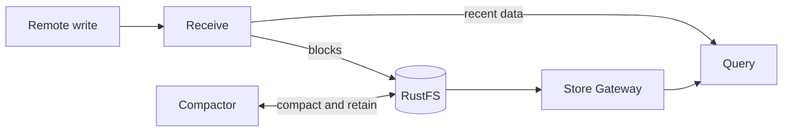

# Thanos

This umbrella chart pins `thanos-community/thanos` 0.33.0 (Thanos v0.42.4)
for the observability hub. The default release contains Receive, Query, Store
Gateway, and Compactor. Query Frontend, Ruler, embedded RustFS, and embedded
`kube-prometheus-stack` are disabled.



## Prerequisites

- Kubernetes 1.30 or later.
- The repository's `prometheus-operator` chart, including its CRDs.
- The repository's `rustfs` chart with bootstrap completed.
- A StorageClass for Receive, Store Gateway, and Compactor PVCs.
- A SOPS-managed `thanos-objstore` Secret in the release namespace.

The Secret must contain `objstore.yml`:

```yaml
apiVersion: v1
kind: Secret
metadata:
  name: thanos-objstore
  namespace: observability
stringData:
  objstore.yml: |
    type: S3
    config:
      bucket: thanos-metrics
      endpoint: rustfs-svc:9000
      access_key: replace-me
      secret_key: replace-me
```

The credentials must match the bucket-scoped identity created by the RustFS
bootstrap Job. This chart does not create production object-store credentials.

## Endpoints and exposure

The in-cluster endpoints are:

- Receive: `http://thanos-receive.observability.svc.cluster.local:10908/api/v1/receive`
- Query: `http://thanos-query.observability.svc.cluster.local:9090`

Query remains cluster-private. The observability platform owns the external
HTTPS Receive route and restricts it to the remote-write path. The chart's
optional Istio resources are disabled by default and are not used by the hub
baseline.

## Baseline

| Component | Replicas | Persistent storage | Retention |
|---|---:|---:|---|
| Receive | 1 | 25 GiB | 48h local TSDB |
| Query | 1 | None | — |
| Store Gateway | 1 | 10 GiB | Cache only |
| Compactor | 1 | 20 GiB | 7d raw, 14d 5m, 30d 1h |

Compactor must remain a singleton. Retention settings delete blocks from the
shared object store. All sizes, StorageClasses, resources, and retention values
are normal Helm overrides.

The upstream component ServiceMonitors and the Thanos health PrometheusRule are
rendered by default for compatibility with existing releases. They remain
inactive until a collector or rule evaluator selects them. The chart does not
install Prometheus, Alloy, Thanos Ruler, or Alertmanager.

## Bounded hub ServiceMonitors

`values-hub-observability.yaml` replaces the upstream component monitors with
four wrapper-owned ServiceMonitors for the observability hub. This profile is
disabled by default. It is intentionally limited to Query, Receive, Store
Gateway, and Compactor; Thanos Ruler, Alertmanager, and the bounded alert
portfolio remain owned by their separate alerting chart. The profile therefore
disables the dependency's broad PrometheusRule. Leaving it enabled would make
many upstream alerts unevaluable because their metric families are deliberately
outside this profile's cardinality budget. Default renders keep those rules
enabled, so existing consumers are unchanged.

```shell
helm template thanos charts/thanos --namespace observability \
  -f charts/thanos/values-hub-observability.yaml
```

Every hub monitor carries
`observability.garyellis.io/hub-health: "true"`, sets `honorLabels: false`, and
uses the same release namespace and service selector as the component it
scrapes. Constant relabeling makes rollout identity stable:

| Component | `job` | `instance` |
|---|---|---|
| Query | `integrations/thanos-query` | `thanos-query` |
| Receive | `integrations/thanos-receive` | `thanos-receive` |
| Store Gateway | `integrations/thanos-storegateway` | `thanos-storegateway` |
| Compactor | `integrations/thanos-compactor` | `thanos-compactor` |

The default hub budget is 1,000 samples and two targets per monitor. The schema
admits only 100–3,000 samples, one–five targets, 30s or 60s intervals, and 5s or
10s scrape timeouts. Template validation also requires the four enabled
components, standalone Receive, unsharded Store Gateway, enough targets for
replicas and Query's rolling surge, disabled Query/Store Gateway autoscaling,
a singleton Compactor, and all dependency-owned component ServiceMonitors to
remain disabled.

Each endpoint applies a positive metric-family allowlist before samples reach
the hub collector. The baseline retains `up`, bounded Go/process health,
request-latency buckets, object-store operation/failure counters, Receive
forwarding/hashring/replication health, and Compactor halt/last-success data.
Broader Go/runtime families, StoreAPI connection and loaded-block inventory,
Ruler metrics, and Alertmanager metrics are deliberately excluded until a
consumer and cardinality budget are reviewed. Synthetic scrape health series
such as `up` remain generated by Prometheus-compatible collectors even though
metric relabeling is not applied to those generated series.

After this chart version is merged, `lab-openstack` must consume the hub profile
only from a published immutable chart version and digest. A source merge alone
is not deployment evidence.

## Validation

```shell
mise run validate -- --chart thanos --env ci
mise run validate -- --chart thanos --env hub
charts/thanos/tests/source-contract.sh charts/thanos
mise run kind-test -- thanos --profile minimal
```

The minimal profile installs Prometheus Operator and the dedicated RustFS
wrapper before Thanos. Thanos working volumes are ephemeral in that profile.
