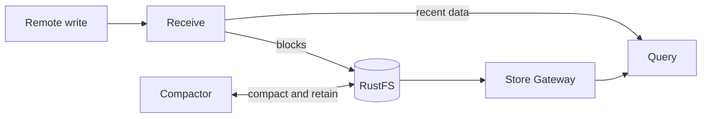

# Thanos

This umbrella chart pins `thanos-community/thanos` 0.33.0 (Thanos v0.42.4)
for the observability hub. The default release contains Receive, Query, Store
Gateway, and Compactor. Query Frontend, Ruler, embedded RustFS, and embedded
`kube-prometheus-stack` are disabled.



## Prerequisites

- Kubernetes 1.30 or later.
- The repository's `prometheus-operator` chart, including its CRDs.
- The repository's `rustfs` chart with bootstrap completed.
- A StorageClass for Receive, Store Gateway, and Compactor PVCs.
- A SOPS-managed `thanos-objstore` Secret in the release namespace.

The Secret must contain `objstore.yml`:

```yaml
apiVersion: v1
kind: Secret
metadata:
  name: thanos-objstore
  namespace: observability
stringData:
  objstore.yml: |
    type: S3
    config:
      bucket: thanos-metrics
      endpoint: rustfs-svc:9000
      access_key: replace-me
      secret_key: replace-me
```

The credentials must match the bucket-scoped identity created by the RustFS
bootstrap Job. This chart does not create production object-store credentials.

## Endpoints and exposure

The in-cluster endpoints are:

- Receive: `http://thanos-receive.observability.svc.cluster.local:10908/api/v1/receive`
- Query: `http://thanos-query.observability.svc.cluster.local:9090`

Query remains cluster-private. The observability platform owns the external
HTTPS Receive route and restricts it to the remote-write path. The chart's
optional Istio resources are disabled by default and are not used by the hub
baseline.

## Baseline

| Component | Replicas | Persistent storage | Retention |
|---|---:|---:|---|
| Receive | 1 | 25 GiB | 48h local TSDB |
| Query | 1 | None | — |
| Store Gateway | 1 | 10 GiB | Cache only |
| Compactor | 1 | 20 GiB | 7d raw, 14d 5m, 30d 1h |

Compactor must remain a singleton. Retention settings delete blocks from the
shared object store. All sizes, StorageClasses, resources, and retention values
are normal Helm overrides.

Component ServiceMonitors and the Thanos health PrometheusRule are rendered.
They remain inactive until a collector or rule evaluator selects them. The
chart does not install Prometheus, Alloy, Thanos Ruler, or Alertmanager.

## Validation

```shell
mise run validate -- --chart thanos --env ci
mise run kind-test -- thanos --profile minimal
```

The minimal profile installs Prometheus Operator and the dedicated RustFS
wrapper before Thanos. Thanos working volumes are ephemeral in that profile.
