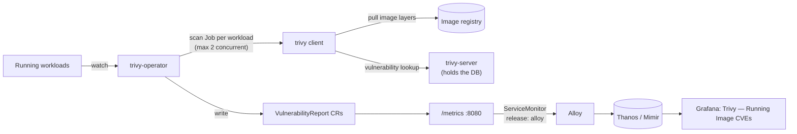

# Trivy Operator

Umbrella chart for [Trivy Operator](https://github.com/aquasecurity/trivy-operator)
0.34.0 (Trivy 0.74.0) using upstream chart `aquasecurity/trivy-operator` 0.36.0
from `https://aquasecurity.github.io/helm-charts/`. Upstream values stay nested
under `trivy-operator:`.

CI and the registry scan an image once, at push time. Trivy Operator scans the
images that are actually running, and rescans each one every 24 hours
(`scannerReportTTL`), so a CVE published after the push shows up against the
workloads that still run the image.



## What it scans

| Scanner | State | Why |
| --- | --- | --- |
| Vulnerabilities (OS packages and language libraries) | on | The purpose of the chart. |
| Config audit | on | Runs in-process, no scan jobs. Overlaps Kyverno, see below. |
| RBAC assessment | on | Runs in-process. Flags risky Roles and ClusterRoles; Kyverno does not assess RBAC permissions. |
| Exposed secrets | off | Secrets baked into an image do not change after push, and CI and the registry already scan for them. It is also the costliest part of a scan job. |
| Infra assessment and compliance (CIS, NSA, PSS) | off | Needs a node-collector job with host mounts, and on kind it reports on kind's node image. |
| SBOM generation | off | SBOMReports only feed ClusterVulnerabilityReports and are the largest objects the operator writes to etcd. |

All namespaces are scanned, `kube-system` included: CNI, DNS and control-plane
images are running code too.

**Client/server mode.** `operator.builtInTrivyServer: true` runs one
`trivy-server` StatefulSet that downloads the vulnerability DB and answers
lookups. Scan jobs are thin clients. In standalone mode every scan job
downloads the DB itself. The server keeps the DB in an emptyDir, so a server
restart costs one download and the chart needs no StorageClass.

The Java index DB (~0.9 GiB) is the exception. JAR identification happens in
the client, so every scan of an image that contains JARs downloads it into
the job's emptyDir. Trivy cannot skip it on a first run. That, plus the
image layers, is why `operator.scanJobTimeout` is 30m: wazuh-indexer takes
more than 15 minutes on the lab link.

**Scan jobs pull from the registry, not from the node.** Each job pulls the
image layers again. Docker Hub rate limits apply. For a private registry the
job uses the workload's `imagePullSecrets`.

## Reading the reports

```sh
kubectl get vulnerabilityreports -A                  # short name: vulns
kubectl get vulns -A -o wide                         # adds counts per severity
kubectl get vulns -n wazuh <report> -o yaml          # full list: CVE, package, installed and fixed versions
kubectl get configauditreports -A -o wide            # short name: configaudit
kubectl get rbacassessmentreports,clusterrbacassessmentreports -A -o wide
```

A report is named `<kind>-<workload>-<container>`, or `<kind>-<hash>` when
that exceeds 63 characters, and is owned by the workload, so it disappears
when the workload does. For Deployments the kind is the current ReplicaSet.
Select by label rather than by name:

```sh
kubectl get vulns -n cert-manager -l trivy-operator.resource.name=cert-manager-cainjector-bb565cb8
```

Critical CVEs that have a fix, across the cluster:

```sh
kubectl get vulns -A -o json | jq -r '.items[] | .metadata.namespace as $ns
  | .report.artifact as $a | .report.vulnerabilities[]
  | select(.severity == "CRITICAL" and .fixedVersion != "")
  | [$ns, "\($a.repository):\($a.tag)", .vulnerabilityID, .resource, .installedVersion, .fixedVersion] | @tsv'
```

## Metrics and dashboard

The operator serves Prometheus metrics on `:8080/metrics`. The chart enables
the upstream ServiceMonitor with the repo-wide `release: alloy` label.

| Metric | Series | Used for |
| --- | --- | --- |
| `trivy_image_vulnerabilities` | 5 per workload container, one per severity | Counts over time, by namespace, image and workload |
| `trivy_vulnerability_id` | 1 per (workload container, CVE, package) | Distinct CVEs, fixable vs no fix, CVE table |
| `trivy_resource_configaudits`, `trivy_role_rbacassessments`, `trivy_clusterrole_clusterrbacassessments` | 4-5 per resource | Not on the dashboard |

`trivy_vulnerability_id` (`operator.metricsVulnIdEnabled`) is the costly one.
Its series count equals the number of findings. A single large image can carry
hundreds. The ServiceMonitor's `metricRelabelings` keep it for High and
Critical only, which removes most of it, and drop `last_modified_date`, which
changes whenever an advisory is edited and would start a new series. Per-image
counts keep every severity. On a large cluster, estimate the stored series
first:

```sh
kubectl get vulns -A -o json \
  | jq '[.items[].report.vulnerabilities[] | select(.severity == "CRITICAL" or .severity == "HIGH")] | length'
```

To drop per-CVE metrics entirely, set `trivy-operator.operator.metricsVulnIdEnabled: false`.
The dashboard's per-CVE panels then stay empty.

The dashboard is `charts/grafana-dashboards/dashboards/platform/trivy-cve.json`
(UID `trivy-running-image-cves`), shipped with the `platform` group of the
grafana-dashboards chart. It has distinct critical and high CVEs, fixable
counts, findings over time and by namespace, the most vulnerable images and
workloads, and a CVE table.

## Kyverno overlap

Config audit (Trivy's built-in checks) and Kyverno's background scan
(PolicyReports) both flag workload misconfigurations such as privileged
containers, host namespaces, missing limits and root users. Kyverno is the
policy engine, the place to enforce and to record exceptions. Trivy config
audit is a fixed baseline that costs no scan jobs and also covers Services,
Ingresses, NetworkPolicies and Roles. Expect duplicate workload findings. If
the duplicates become noise, set `trivy-operator.operator.configAuditScannerEnabled: false`.

## Resources

| Component | Request | Limit |
| --- | --- | --- |
| trivy-operator | 50m / 384Mi | 500m / 1Gi |
| trivy-server | 100m / 128Mi | 1 / 1Gi |
| each scan job (max 2) | 100m / 128Mi | 500m / 512Mi |

Operator memory grows with the number of pods, workloads and reports it
caches. Scan duration grows with image size and whether the image has JARs
(see client/server mode above). Scan jobs write the layer analysis cache and,
for images with JARs, the Java DB to node ephemeral storage.

## CRDs and upgrades

The report CRDs ship in the upstream chart's `crds/` directory. Helm installs
them on first install and never upgrades them. When the chart version is
bumped, apply the new CRDs first:

```sh
helm dependency build charts/trivy-operator
helm show crds charts/trivy-operator/charts/trivy-operator-*.tgz | kubectl apply --server-side -f -
```

## Usage

```sh
helm dependency build charts/trivy-operator
helm upgrade --install trivy-operator charts/trivy-operator \
  --namespace trivy-system --create-namespace
```

## Validation

```sh
uv run chart-manager chart validate trivy-operator
uv run chart-manager local up --chart trivy-operator --profile minimal
helm test trivy-operator -n trivy-system
```

The helm test starts a Pod running a pinned curl image and waits up to
`tests.timeout` (10m) for its VulnerabilityReport. On a fresh install the scan
queues behind the first scan of every running image. It then asserts that the
report is for the pinned tag and that `trivy_image_vulnerabilities` series for
the Pod are on `/metrics`. Deleting the Pod after the test removes its report.
