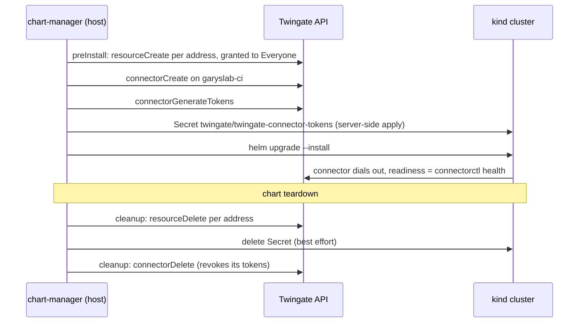

# twingate-connector

Wrapper chart for the upstream
[`twingate/connector`](https://github.com/Twingate/helm-charts) chart. It
runs one Twingate Connector, which dials out to the `garyslab` tenant and
proxies Twingate client traffic to resources reachable from the cluster.
No inbound ports, Service or CRDs.

| | |
|---|---|
| Upstream chart | `connector` 0.1.35, `https://twingate.github.io/helm-charts` |
| Image | `twingate/connector:1.93.0`, digest-pinned |
| Values | nested under `connector:`; upstream settings under `connector.connector:` |

## Tokens

A connector authenticates with an access/refresh token pair that belongs to one
connector object in the Twingate admin API. This chart never takes tokens as
values (they would end up in the Helm release Secret and shell history). It
reads them from an existing Secret:

```yaml
connector:
  connector:
    network: garyslab
    existingSecret: twingate-connector-tokens  # keys: TWINGATE_ACCESS_TOKEN, TWINGATE_REFRESH_TOKEN
```

The Secret must hold **only** the two token keys. The chart sets `TWINGATE_URL`
from `network`, and the connector exits if `TWINGATE_NETWORK` is also set.

A token pair identifies one connector object. Running the same pair in two
places (for example, copying the Secret to a second cluster) makes them contend
for one connector. Pods read the Secret only at start: after changing it,
`kubectl rollout restart deployment/twingate-connector`.

## Cluster test

The `minimal` profile makes a new connector for the test cluster and deletes it
at teardown. The two hooks call
[`scripts/twingate-ci-connector`](../../scripts/twingate-ci-connector):



The connector is named `ci-<user>-<cluster>-<namespace>`, e.g.
`ci-gary-chart-manager-twingate`, so two developers' default clusters never
share one. The Secret is annotated with the connector id. On a re-test the
hook does nothing when that id still matches. Otherwise (connector deleted in
the console, Secret deleted) it mints new tokens and restarts the running
connector. Twingate has no mutation that revokes a token by itself; deleting
the connector is what makes its tokens invalid.

Addresses listed after `create` in `chart-lifecycle.yaml` become Twingate
Resources, one per address, all ports, granted to `TWINGATE_GROUP` (default
`Everyone`). The connector resolves them with cluster DNS, for example:

```yaml
preInstall:
  - scripts/twingate-ci-connector
  - create
  - hubble-ui.kube-system.svc.cluster.local   # http://hubble-ui.kube-system.svc.cluster.local
```

Each is named `<connector> <address>`. On re-test the hook creates missing
ones and deletes ones no longer listed; teardown deletes them all. The profile
publishes none yet. Every cluster uses the same `svc.cluster.local` names, so
two clusters whose connectors share `garyslab-ci` can serve each other's
requests.

```bash
export TWINGATE_API_KEY=...        # admin API key, read-write
chart-manager chart test twingate-connector
chart-manager chart teardown twingate-connector
```

`chart test` leaves the connector running; only `chart teardown` deletes it.
A run killed before teardown leaves a `ci-*` connector on `garyslab-ci`; delete
it in the admin console. In CI the key comes from the `TWINGATE_API_TOKEN`
repository secret, passed only to this chart's test and teardown steps.

The hooks accept `TWINGATE_API_TOKEN` in place of `TWINGATE_API_KEY`.
`TWINGATE_REMOTE_NETWORK` and `TWINGATE_CONNECTOR_NAME` override the defaults.
`TWINGATE_NETWORK` and `TWINGATE_SECRET_NAME` can be overridden too, but must
match `connector.connector.network` and `connector.connector.existingSecret`.
Edits to `scripts/twingate-ci-connector` do not select this chart in CI; run
`chart-manager chart test twingate-connector` locally after changing it.

There is no Helm test: the readiness probe (`connectorctl health`) only passes
once the connector is connected, and the run waits for it.

## Other environments

Create the connector in the Twingate admin console (or with the hook script),
put its tokens in the Secret named by `existingSecret` (with External Secrets
or `kubectl create secret generic`), then install with `values.yaml` plus an
environment overlay.
