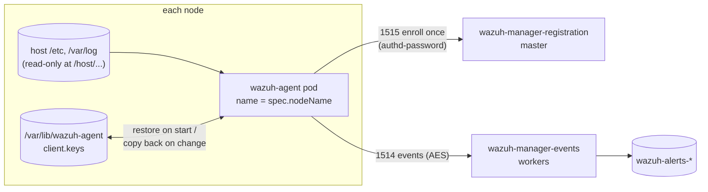

# wazuh-agent

Runs the Wazuh agent as a DaemonSet: one agent per node, named after the node.
Each agent enrolls into the `charts/wazuh` manager cluster. It's a
first-party chart built on the official `wazuh/wazuh-agent` image, following
the upstream
[DaemonSet guide](https://documentation.wazuh.com/current/deployment-options/deploying-with-kubernetes/kubernetes-deployment.html#deploying-the-wazuh-agent-as-a-daemonset).
There is no upstream Helm chart.



## What it monitors

| Capability | Default | Notes |
| --- | --- | --- |
| File integrity (FIM) | `/host/etc`, full scan every 12h | `fim.directories[].realtime: true` alerts on change through inotify. `values-ci.yaml` turns it on for `/host/etc`. |
| Host log files | `/host/var/log/syslog`, `/host/var/log/auth.log` | `logs[]` sets the location and format. The agent retries missing files and logs an `ERROR (1103)` for each. |
| Falco alerts | `/host/var/log/falco/events.json` (`json`) | Written by `charts/falco`. The manager's JSON decoder parses each line; `charts/wazuh` `files/manager/falco_rules.xml` maps Falco priorities to alert levels. |
| Rootcheck, SCA, syscollector, active response | off | Inside a container these inspect or act on the agent's own container (its packages, processes, and ports), not the node. |

Paths are the node's paths seen under `/host`. `host.paths` (allow-listed:
`/etc`, `/var/log`, `/usr/bin`, `/usr/sbin`, `/usr/local/bin`, `/bin`,
`/sbin`, `/boot`, `/opt`) are mounted read-only at `/host<path>`. Rendering
fails if a FIM directory or log location isn't under one of them.

**Overlap with Alloy.** Alloy ships container and pod logs for search.
This agent does security analysis: FIM, and host auth and system logs run
through the Wazuh ruleset into alerts. Don't point `logs[]` at
`/var/log/containers`.

**Follow-up:** Kubernetes audit logs. That needs an API server audit policy
and a log path on the control-plane nodes, then a `logs[]` entry with
`format: json`.

**On kind.** The "node" is a Docker container (Debian) running inside the
Docker VM, not your Mac. FIM sees that container's `/etc`. There is no
syslog, `auth.log`, or journald file under `/var/log`, so those entries only
report the missing files. FIM and Falco alerts are the useful signals locally.

## Prerequisites

- A `charts/wazuh` release. By default agents use its in-cluster Services
  for release `wazuh` in namespace `wazuh`:
  `wazuh-manager-registration...:1515` (master, enrollment) and
  `wazuh-manager-events...:1514` (workers; the master when there are no
  workers). `manager.events` and `manager.registration` are explicit
  `address`/`port` values that the schema requires.
- **Managers outside the cluster:** set `manager.agentServices.type:
  LoadBalancer` (with `loadBalancerSourceRanges`) in `charts/wazuh`. Then point
  `manager.events.address` and `manager.registration.address` here at those
  addresses or DNS names.
- `enrollment.existingSecret` (required, no default): a Secret with the
  manager's enrollment password under `enrollment.key` (default
  `authd-password`, the `charts/wazuh` credentials key). In the release
  namespace you can reference the `charts/wazuh` Secret directly; CI uses
  `wazuh-credentials`. Elsewhere, sync the same value with ExternalSecrets.

## Enrollment and identity

- The agent name is `spec.nodeName`. Groups come from `enrollment.groups`
  (default `default`), and they must exist on the manager.
- The image handles configuration natively. The chart mounts an `ossec.conf`
  with the image's `CHANGE_*` placeholders, and the image fills them from
  `WAZUH_MANAGER_SERVER`/`_PORT`, `WAZUH_REGISTRATION_SERVER`/`_PORT`,
  `WAZUH_AGENT_NAME`, and `WAZUH_AGENT_GROUP`. It writes
  `WAZUH_REGISTRATION_PASSWORD` to `etc/authd.pass`. The chart generates only
  the FIM and `localfile` sections.
- **Identity persists across pod restarts.** Enrollment writes
  `etc/client.keys`, which holds the agent ID and key. The agent replaces
  that file rather than writing into it, so the chart can't use a bind mount
  or symlink. Instead:
  - An `/entrypoint-scripts` hook restores `client.keys` from the node's
    `identity.hostStatePath` (default `/var/lib/wazuh-agent`, created
    root-only, mode 0700) before the agent starts.
  - An s6-supervised `identity-sync` service copies it back whenever it
    changes.

  A new pod on the same node reconnects as the same agent without
  enrolling again.
- **Why that matters.** The manager rejects re-enrolling an existing name
  while that agent has been disconnected for less than an hour ("Duplicate
  agent name"). A lost `client.keys` would leave the node unmonitored until
  that window passes, or until someone deletes the stale agent
  (`DELETE /agents?agents_list=<id>&status=all&older_than=0s`).
- **When the node goes away.** The node's state directory goes with it. The
  old agent turns `disconnected`, and a replacement node with a new name
  enrolls as a new agent. Clean up disconnected agents on the manager.

## Privileges (and the policy exception)

The container runs as root. The image's s6-overlay init needs it (it chowns
its tree, then the agent daemons drop to the `wazuh` user), and FIM and
logcollector need it to read root-owned host files. Everything else is
minimized:

| Setting | Value | Why |
| --- | --- | --- |
| `privileged`, `hostPID`, `hostNetwork`, `hostIPC` | off | Not needed for file and log monitoring. |
| `allowPrivilegeEscalation` | false | The daemons drop privileges with `setuid()`, not setuid binaries. |
| Capabilities | drop ALL; add `CHOWN DAC_OVERRIDE FOWNER SETGID SETUID KILL` | s6 init and ownership fixes, reading root-only host files, dropping to `wazuh`, supervising processes. |
| Host mounts | `host.paths` read-only; only `identity.hostStatePath` writable | The agent can't modify the node. |
| ServiceAccount token | not mounted | The agent doesn't talk to the Kubernetes API. |
| Tolerations | `node-role.kubernetes.io/control-plane:NoSchedule` | So control-plane nodes are monitored too. |
| `priorityClassName` | `system-node-critical` | So node pressure doesn't evict the agent before the workloads it watches. |

The repo's `require-non-root` Kyverno policy can't pass, and the pipeline has
no per-resource exception. `chart-lifecycle.yaml` therefore sets
`validators.policy: false`, the same approach `charts/wazuh` uses.
`tests/render-contract.sh` re-asserts every row above, plus: no Services or
RBAC, no rendered Secret, a pinned image, and a non-root helm test.

## Versions

Agent version must be **at most the manager's version**. Upgrade
`charts/wazuh` first, then `image.tag` here. Renovate tracks the tag. Both
charts pin 4.14.7.

## Testing

```bash
charts/wazuh-agent/tests/render-contract.sh charts/wazuh-agent
uv run chart-manager chart validate wazuh-agent
uv run chart-manager local up --chart wazuh-agent --profile minimal   # requires wazuh/minimal
helm test wazuh-agent -n wazuh
```

The helm test logs in to the Wazuh API as `tests.api.username` (default
`wazuh-wui`). The password comes from `tests.api.existingSecret`, which
defaults to `enrollment.existingSecret`, under key `api-password`. The test
asserts that the agent named after the node it runs on is registered exactly
once and is `active`. The API serves a certificate it generates itself, so
TLS isn't verified there.

### Verifying identity reuse across a restart

The helm test proves an agent enrolls exactly once, but on a fresh install it
can't prove that a *restarted* pod reconnects with the stored identity rather
than re-enrolling. The test pod holds no Kubernetes API token by design (see
the privileges table), so it can't delete a pod itself. Verify identity reuse
manually instead:

```bash
node=<a node name>
pod=$(kubectl get pod -n wazuh -l app.kubernetes.io/name=wazuh-agent \
  --field-selector spec.nodeName=$node -o name)
# Agent id before the restart.
kubectl exec -n wazuh "$pod" -c agent -- cut -d' ' -f1 /var/ossec/etc/client.keys
kubectl delete -n wazuh "$pod"           # DaemonSet reschedules on the same node
kubectl rollout status ds/wazuh-agent -n wazuh
# Same id => the restore hook reused the node's client.keys (no re-enrollment).
kubectl exec -n wazuh "$(kubectl get pod -n wazuh \
  -l app.kubernetes.io/name=wazuh-agent \
  --field-selector spec.nodeName=$node -o name)" \
  -c agent -- cut -d' ' -f1 /var/ossec/etc/client.keys
```

The two ids must match. A changed id means the restore path (`10-restore-identity.sh`
/ `identity-sync`) regressed.
