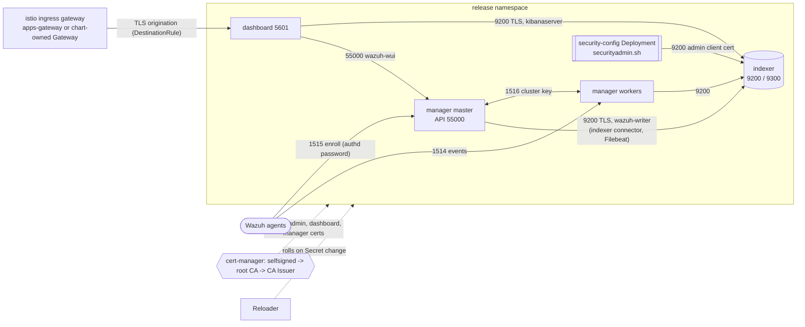

# wazuh

First-party chart for the Wazuh 4.14 server stack: indexer (OpenSearch), a
manager cluster (one master plus N workers), and the dashboard. All TLS comes
from cert-manager. All credentials come from one Secret that you supply.

| Component | Workload | Services (port) |
| --- | --- | --- |
| Indexer | StatefulSet, `podManagementPolicy: Parallel` | `<release>-indexer` (9200 REST), headless `<release>-indexer-nodes` (9300 transport) |
| Manager master | StatefulSet, 1 replica | `<release>-manager-api` (55000, ClusterIP only), `<release>-manager-registration` (1515 enrollment) |
| Manager workers | StatefulSet, `manager.workers.replicas` | `<release>-manager-events` (1514 agent events; targets the master when there are 0 workers) |
| Manager cluster | both StatefulSets | headless `<release>-manager-cluster` (1516) |
| Dashboard | Deployment | `<release>-dashboard` (5601, HTTPS) |



## Prerequisites

- **cert-manager** (`charts/cert-manager`). By default the chart creates a
  self-signed root CA and a namespaced CA `Issuer`. Set
  `certificates.issuerRef` to use an existing CA-type issuer instead. It must
  populate `ca.crt`, because every component trusts the `ca.crt` of its own
  leaf Secret.
- **Reloader** (`charts/reloader`), required in production. OpenSearch, the
  dashboard, Filebeat, and the manager load certificates and passwords only
  at startup. With `reloader.enabled: true` (default), each workload names
  the exact Secrets it reads in `secret.reloader.stakater.com/reload`, and
  Reloader rolls it when cert-manager renews a certificate or a credential
  is rotated. The annotations do nothing without Reloader, and renewed
  certificates would then only be picked up by a manual restart.
- **`vm.max_map_count >= 262144`** on nodes that run the indexer. Configure it
  at the node level (node image or a tuning DaemonSet). If you can't,
  `indexer.sysctlInitContainer.enabled: true` adds a privileged init container
  that raises it. kind nodes on Docker Desktop, Colima, or OrbStack already
  report 262144.

## Credentials Secret

Nothing has a default value. Rendering fails unless
`credentials.existingSecret` names a Secret in the release namespace with
these keys:

| Key | Used by |
| --- | --- |
| `indexer-admin-password` | OpenSearch `admin` user (all_access): break-glass login and the indexer helm test. No workload holds it. |
| `indexer-dashboard-password` | OpenSearch `kibanaserver` user (the dashboard server). |
| `indexer-writer-password` | OpenSearch `wazuh-writer` user (role `wazuh_writer`) used by the manager's indexer connector and Filebeat. |
| `dashboard-cookie-password` | Dashboard session-cookie encryption key, at least 32 characters. |
| `api-password` | Wazuh API user `wazuh-wui` (dashboard to manager). The API requires 8-64 characters with upper case, lower case, a digit, and a symbol. |
| `authd-password` | Agent enrollment password (`authd.pass`, port 1515). |
| `cluster-key` | Manager cluster key: exactly 32 alphanumeric characters. |

Keep passwords to `A-Z a-z 0-9 . - + @`, 12 characters or more, and don't
start them with a symbol. The upstream image entrypoints substitute these
values unescaped into `sed` expressions, shell `echo`, and YAML.

Environments supply the Secret with ExternalSecrets:

```yaml
apiVersion: external-secrets.io/v1
kind: ExternalSecret
metadata:
  name: wazuh-credentials
  namespace: wazuh
spec:
  refreshInterval: 1h
  secretStoreRef: {kind: ClusterSecretStore, name: vault}
  target: {name: wazuh-credentials}
  dataFrom:
    - extract: {key: platform/wazuh}   # holds the seven keys above
```

For CI and kind only, `credentials.create: true` renders the Secret from
`credentials.values.*` (see `values-ci.yaml`). Every value is `required`. The
chart never uses `randAlphaNum`, `lookup`, or in-template hashing.

**How password hashes are produced.** No bcrypt hash is ever stored in Git or
rendered by Helm. An init container (`render-security-config`) in each indexer
pod and in the `security-config` Deployment runs the indexer image's own
`plugins/opensearch-security/tools/hash.sh -env <VAR>`. It reads the passwords
from the Secret through environment variables and writes `internal_users.yml`
into a memory-backed `emptyDir`. `helm template` output stays deterministic
and GitOps-safe.

**Rotation.** Update the Secret (for example, the ExternalSecret source).
No `helm upgrade` is needed. Reloader then restarts every workload that lists
the Secret, including the `security-config` Deployment. That Deployment
re-hashes the passwords and re-applies the security index on start. Order of
events and what to expect:

1. The dashboard and managers restart with the new indexer passwords while
   the indexer still holds the old hashes. They get 401s and retry: Filebeat
   and the indexer connector buffer, and the dashboard shows "not ready".
2. `security-config` applies the new hashes, typically within a minute, and
   the consumers recover on their next retry. There is no manual step.
3. `api-password`: the master updates `wazuh-wui` on start
   (`create_user.py`), and the dashboard restarts with the same value.
4. `authd-password`: only new enrollments use it. Existing agents keep
   their keys, so hand the new password to your agent enrollment config.
5. `cluster-key`: master and workers both list the Secret and restart
   together. During the roll, nodes with different keys can't talk, so the
   manager cluster is briefly split until every node has restarted. Rotate it
   in a maintenance window.

To avoid even the brief 401 window, add a new credential alongside the old
one first. The chart has no dual-password mechanism, so the window is
accepted.

## Certificates and trust

`plugins.security.authcz.admin_dn` (indexer superuser) and
`plugins.security.nodes_dn` (cluster membership) are distinguished names:
`CN=<fullname>-admin|<fullname>-indexer, OU=<organizationalUnit>,
O=<organization>`. They come from `certificates.subject`, so the DNs and the
requested certificates can't drift. `organizationalUnit` defaults to
`<fullname>.<namespace>`, unique per release rather than a guessable
constant.

**Anyone who can get a certificate with that subject from the issuer
controls the indexer.** The chart's default is a self-signed root CA with a
namespaced `Issuer`, which only this namespace can use. If you set
`certificates.issuerRef` to a shared `ClusterIssuer`, every namespace that
can create a `Certificate` against it can mint an admin or node DN. Prefer a
namespaced `Issuer`, or a dedicated intermediate CA for this release, and
restrict who can create `Certificate`/`CertificateRequest` objects (for
example with cert-manager's approver-policy).

## Istio exposure (dashboard only)

With `istio.enabled`, the dashboard is served on `istio.dashboard.hosts`. When
`hosts` is empty, the host is `<istio.dashboard.hostPrefix>.<appsDomain>`, for
example `wazuh.k8s.home.lab.io`, or `wazuh.kind.local` locally. The chart
renders a `networking.istio.io/v1` VirtualService for that host. It binds to
one of two gateways:

| `istio.gateway.create` | Gateway used | When to use it |
| --- | --- | --- |
| `false` (default) | The shared gateway named by `istio.gateway.existing` (default `istio-ingress/apps-gateway`). | Environments whose apps gateway already covers the host, for example `*.k8s.home.lab.io`. Used by `values-ci.yaml` (`*.kind.local`). |
| `true` | A chart-owned `Gateway` named `istio.gateway.name` (default: the chart fullname) in `istio.gateway.namespace` (default: the release namespace). | You need a dedicated host or certificate. |

The chart-owned Gateway mirrors `apps-gateway`: an HTTP server on port 80 that
redirects to HTTPS, and an HTTPS server on port 443 with
`tls.mode: SIMPLE` and `istio.gateway.tls.credentialName`, which is required
when `create=true`. `istio.gateway.selector` picks the ingress workload
(default `istio: gateway-internal`, the same selector `apps-gateway` uses).
Port names are suffixed with the Gateway name, so they don't collide when
Istio merges several Gateways onto the same workload ports. The more specific
host (`wazuh.kind.local`) wins over a wildcard (`*.kind.local`) by SNI.

One caveat when a chart-owned Gateway reuses the shared wildcard
certificate. `istioctl analyze` reports IST0138
("Duplicate certificate in multiple gateways"). A browser that already holds
an HTTP/2 connection for another `*.kind.local` host (for example Hubble) can
reuse it for `wazuh.kind.local`. The request then hits `apps-gateway`'s routes
and returns 404; a new connection or a private window works. To avoid this,
give the chart-owned Gateway a dedicated certificate, or use the shared
gateway (`create: false`) when its hosts already cover the dashboard.

**The credentialName namespace rule.** Istio resolves a Gateway's
`credentialName` in the namespace of the gateway *workload*, which is
`istio-ingress`, not in the namespace of the `Gateway` resource. The Secret
must already exist there. The chart never creates resources in the gateway
namespace. Locally, the shared gateway already serves `apps-wildcard-cert`,
the `*.kind.local` certificate that `charts/istio-gateway` issues in
`istio-ingress`.

**Backend TLS.** The dashboard serves HTTPS only, using this chart's
certificate. The gateway terminates the client session, then originates a
new TLS session to port 5601. A DestinationRule with `tls.mode: SIMPLE` and
`sni: <dashboard>.<ns>.svc.cluster.local` configures that second session.
Istio 1.2x verifies upstream certificates by default, and the gateway can
only read a CA from its own namespace (the same rule as above). So the chart
supports two modes:

- **Default:** `insecureSkipVerify: true`. The hop is encrypted but not
  authenticated. Use it where the namespace network path is trusted.
- **Verified:** set `istio.dashboard.backendTLS.credentialName` to a Secret in
  the gateway namespace whose `ca.crt` is this chart's CA. For example, issue
  the chart from the same `ClusterIssuer` as the gateway and copy its CA with
  trust-manager or ExternalSecrets. The rule then also pins `subjectAltNames`.

**Locally.** The `minimal` cluster-test profile requires `istio-gateway` (which
brings cert-manager, istio-base, and istiod). kind maps host port 443 to the
gateway, so the dashboard is at `https://wazuh.kind.local`:

```bash
curl -k --resolve wazuh.kind.local:443:127.0.0.1 https://wazuh.kind.local/api/status
```

The `dashboard-ingress` helm test makes the same request from inside the
cluster. It connects to `tests.ingressGateway.service` with the dashboard host
as SNI and Host header, and doesn't render when Istio is disabled.

**Agent ports.** Ports 1514 and 1515 are not routed through Istio.
`manager.agentServices.type` controls both agent Services: `ClusterIP`
(default) or `LoadBalancer`. `LoadBalancer` requires non-empty
`loadBalancerSourceRanges` (enforced by the schema). The two Services get
separate IPs unless the load balancer can share one, for example MetalLB's
`metallb.universe.tf/allow-shared-ip` annotation on both through
`manager.agentServices.annotations`. Otherwise point agents' enrollment
`manager_address` at the registration IP and their server `address` at the
events IP. The repository's `forbid-load-balancer` policy flags
LoadBalancer, so opt in deliberately. Routing 1514/1515 through the ingress gateway would need TCP
Gateway servers plus new gateway Service ports and kind `extraPortMappings`
owned by `charts/istio-gateway` and `kind-config.yaml`. That's out of scope
for this chart.

## SSO (OIDC and SAML)

SSO is disabled by default. Basic auth against the internal users stays on as
the break-glass path.

```yaml
sso:
  publicUrl: https://wazuh.k8s.home.lab.io     # default: https://<dashboard host>
  oidc:
    enabled: true
    connectUrl: https://idp/realms/lab/.well-known/openid-configuration
    logoutUrl: https://idp/realms/lab/protocol/openid-connect/logout
    rolesKey: groups
    clientSecret: {name: wazuh-oidc}           # keys client-id / client-secret
  saml:
    enabled: true
    idpMetadataUrl: https://idp/realms/lab/protocol/saml/descriptor
    idpEntityId: https://idp/realms/lab
    exchangeKeySecret: {name: wazuh-saml}      # key exchange-key, >= 32 chars
  roleMappings:                                # IdP group -> OpenSearch role
    all_access: [wazuh-admins]
    kibana_user: [wazuh-users]
```

The chart generates only the parts that vary: the auth domains in `config.yml`
and `roles_mapping.yml`. The rest of the security configuration ships verbatim
from the 4.14 image under `files/indexer/security/`. Secrets reach the indexer
(`${env.SAML_EXCHANGE_KEY}`) and the dashboard (`${OIDC_CLIENT_*}`) as
environment variables. To give SSO users Wazuh API permissions, map their
backend roles in the dashboard (Server management, Security). That
configuration is outside the chart.

**Re-apply behavior.** The `security-config` Deployment runs
`securityadmin.sh -cd` with the admin client certificate every time it
starts. It restarts when the security ConfigMap changes (a pod checksum), or
when the credentials, admin, or node Secret changes (Reloader). It replaces
the security index with the chart's files: users, roles, or mappings created
in the dashboard UI are overwritten, so Git is the source of truth. If the
indexer isn't reachable within 5 minutes, it exits non-zero and restarts.
The first boot also seeds the index directly
(`allow_default_init_securityindex`).

## Configuration notes

- `indexer.replicas: 1` selects `discovery.type: single-node`; more replicas
  bootstrap from `cluster.initial_cluster_manager_nodes`. Switching between
  single-node and multi-node needs a fresh cluster.
- `manager.localRules` and `manager.localDecoders` replace
  `files/manager/local_*.xml`. They're copied in on every start.
- `files/manager/falco_rules.xml` (IDs 100100-100105, group `falco`) maps
  Falco alerts from `charts/falco`, which `charts/wazuh-agent` reads as JSON,
  to levels by Falco priority: Emergency/Alert/Critical 12, Error 10,
  Warning 7, Notice 5, Informational/Debug 3. It's separate from
  `localRules`, so overriding that doesn't drop Falco coverage.
- `manager.archives.enabled` turns on `logall_json` and the Filebeat
  `archives` input. `manager.vulnerabilityDetection.enabled` controls the CVE
  feed (several GB), which is off in CI.
- Every image is pinned (`images.*.tag`), and Renovate's `helm-values`
  manager tracks the tags. Pod checksums roll a workload only when a file it
  reads at runtime changes: the indexer hashes only `opensearch.yml`.
  Certificates and credentials roll through Reloader instead.
- The indexer, dashboard, `security-config`, and tests run as non-root with
  `drop: [ALL]`. The manager image needs root: s6-overlay chowns its data and
  drops privileges per daemon. `chart-lifecycle.yaml` therefore disables the
  policy validator, and `tests/render-contract.sh` re-asserts non-root for
  every other workload and ClusterIP-only Services by default.
- **Indexer readiness.** An exec probe requires `_cluster/health?local=true`
  to return 200, which means the node has joined a cluster with an elected
  cluster manager and the security index is initialized. A plain TCP check
  passes earlier, and a rolling update could then restart the next node
  while this one is still rejoining. The probe authenticates with the node's
  own certificate. The `clientcert_auth_domain` maps its CN to
  `wazuh_node_monitor`, which has `cluster_monitor` only, so no password is
  involved. The basic-auth domain runs first with `challenge: false`: a
  challenging domain would answer 401 before the certificate domain is
  tried. Clients must therefore send credentials up front, as `curl -u`, the
  dashboard, and Filebeat do.
- **Least privilege.** The manager authenticates to the indexer as
  `wazuh-writer` (role `wazuh_writer`). It gets cluster monitor/bulk,
  index-template and ingest-pipeline management, and CRUD plus index
  creation on `wazuh-alerts-*`, `wazuh-archives-*`, `wazuh-states-*`,
  `wazuh-monitoring-*`, and `wazuh-statistics-*`. No manager pod holds the
  admin password.
- **Scheduling.** With `affinity` empty, indexer pods and manager workers
  get a preferred anti-affinity across nodes (`kubernetes.io/hostname`). Any
  non-empty `affinity` replaces it.
- **Effectively immutable after install:** `*.storage.size` and
  `storageClassName` (StatefulSet volumeClaimTemplates can't change),
  `fullnameOverride`/release name (every resource and certificate DN is
  derived from it), `certificates.subject` (it changes `admin_dn`/`nodes_dn`
  and needs every node restarted together), and switching `indexer.replicas`
  between 1 and 3+.
- **Indexer scale-down:** one node at a time. First drain it with
  `PUT _cluster/settings {"persistent":{"cluster.routing.allocation.exclude._name":"<release>-indexer-N"}}`,
  wait for `relocating_shards: 0`, then reduce `replicas` by one and clear
  the exclusion. `replicas: 2` is rejected: two nodes can't keep a cluster
  manager quorum when one fails.

## Out of scope

- Wazuh agents. There's no agent DaemonSet: enroll agents against
  `<release>-manager-registration:1515` with the `authd-password`.
- LDAP or Active Directory auth domains, snapshot repositories, and an
  external indexer.
- Wazuh 5.0.

## Wazuh 5.0 migration seam

Wazuh 5.0 removes Filebeat from the manager. Everything Filebeat-specific
lives in `templates/manager/_filebeat.tpl`: `filebeat.yml`, the `SSL_*` and
`INDEXER_URL` environment, and the `/etc/filebeat` and `/var/lib/filebeat`
mounts. The rest of the chart reaches it only through `wazuh.filebeat.*`
includes. The 5.0 migration deletes that file and those include lines.
Filebeat has no certificate of its own: it reuses the manager client
certificate, which the permanent `<indexer>` connector also uses.

## Testing

```bash
charts/wazuh/tests/render-contract.sh charts/wazuh   # offline contract (also run by CI)
uv run chart-manager chart validate wazuh
uv run chart-manager chart test wazuh --profile minimal
```

Helm tests check four things:

- Indexer cluster health: `green` when multi-node, `green` or `yellow` when
  single-node.
- A Wazuh API login as `wazuh-wui` returns a JWT. The API serves a
  certificate it generates itself, so this check doesn't verify TLS.
- The dashboard `/api/status` endpoint returns 200 over TLS verified against
  the chart CA.
- With Istio enabled, `https://<dashboard host>/api/status` returns 200 through
  the ingress gateway Service.
